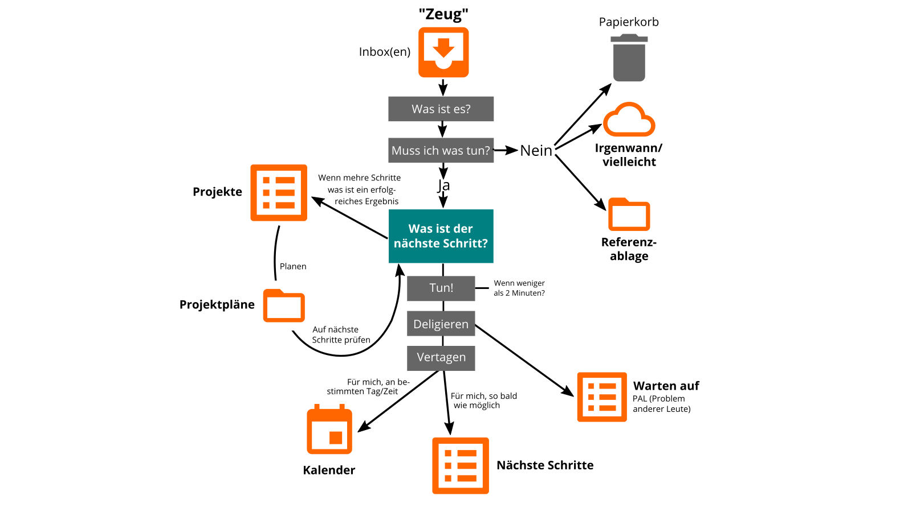

## Lernpfad Produktivität & Stressfreiheit

In diesem Lernpfad lernst du, komplexe Wissensarbeit selbst zu organisieren und der täglichen Informationsflut stressfrei zu begegnen. Viele Menschen stehen vor dem Problem, im Hamsterrad der Tages- und Routinetätigkeiten zu versinken und keine Zeit für wichtige Aufgaben zu haben. 

Der Lernpfad Produktivität & Stressfreiheit setzt auf der Methode [Getting Things Done](https://gettingthingsdone.com) (GTD) von David Allen auf. Durch das schrittweise Erlernen der Regeln und Prinzipien, sowie deren Einübung in den Katas wirst du dir in diesem lernOS Sprint dein eigenes GTD-System aufbauen.

Bei Getting Things Done geht es im Kern darum, alle Aufgaben und Ideen aus dem Kopf und in ein System zu bekommen, dem man vertraut (David Allen: "Mind like Water"). Das "Zeug", das einen täglich einprasselt, sammelt man in einer oder mehreren Inboxen. Diese werden in einem Prozess mit fünf Schritten regelmäßig bearbeitet. Um das eigene System aktuell zu halten, werde wöchentliche (Weekly Review) und tägliche Reviews (Daily Review) durchgeführt.

Mit den Katas in diesem Lernpfad kannst du das produktive und stressfreie Lernen und Arbeiten in einem Sprint erlernen:

1. **Kata:** Top 10 Quellen zu GTD
2. **Kata:** Zeug sammeln und Mind sweepen
3. **Kata:** Richte deine GTD-Umgebung ein
4. **Kata:** Welche Inbox(en) willst du verwenden?
5. **Kata:** Welche Listen willst du anlegen und führen?
6. **Kata:** Inbox Zero in 4 Schritten
7. **Kata:** Richte deine Projektumgebung ein
8. **Kata:** Lege deine Referenzablage an
9. **Kata:** Mache ein Weekly Review
10. **Kata:** Mache ein Daily Review
11. **Kata:** Die 6 Fokushorizonte von Getting Things Done
