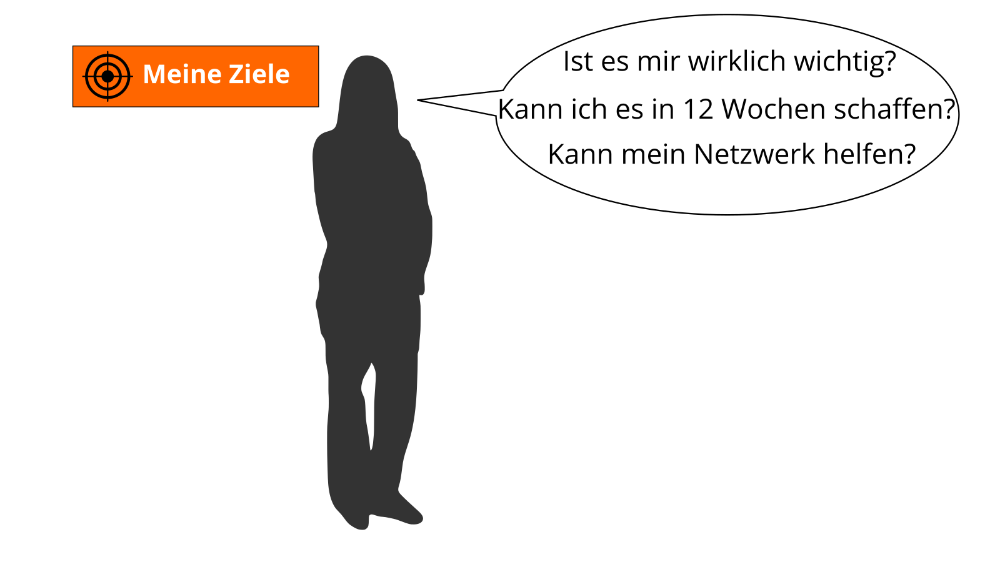

### Wähle ein geeignetes Ziel für den Lernpfad (Kata)

In dieser Kata wählst Du ein geeignetes Ziel für den Sprint aus. Das Ziel kann ein bestehendes OKR (Objective & Key Result) sein oder ein neues. Außerdem wirst du dir überlegen, welches strategische Netzwerk du dir aufbauen musst, um das Ziel leichter zu erreichen.

**Schritt 1:**

Was willst du in den nächsten zwölf Wochen erreichen? Wähle ein Ziel, das Dich wirklich, wirklich wichtig ist und bei dem du im Sprint Fortschritte machen kannst. Wenn du deine Ziele schon selbstorganisiert mit der Methode Objectives & Key Results (OKR) festlegst, kannst du eines dieser Ziele für den Lernpfad auswählen.

Wenn nicht, wirst die die OKR-Methode von Google kennenlernen, um dieses Ziel zu definieren. Für den Lernpfad ist es nicht erste Priorität, das Ziel zu erreichen. Im Fokus steht zu lernen, wie du mit Hilfe eines offenen Arbeitsstils und der Entwicklung eines Netzwerks Ziele einfacher erreichst.

Wähle ein Ziel für die nächsten 12 Wochen. Verwende folgende Testfragen, um ein geeignetes Ziel zu finden:

* Ist es mir wirklich, wirklich wichtig?
* Kann ich es in 11 Wochen erreichen?
* Kann ein Netzwerk bei der Zielerreichung helfen?

Wenn du Probleme hast, ein gutes Ziel zu finden, denke an Ziele zu deine Rollen, Aktivitäten oder Projekten. Wenn du dazu beitragen möchtes, die Welt zu einem besseren Ort zu machen, kannst du dir auch ein Ziel aus dem Bereich der [17 Ziele für nachhaltige Entwicklung der Vereinten Nationen](https://www.un.org/sustainabledevelopment/sustainable-development-goals) wählen.

**Schritt 2:**

Verwende die Methode Objective & Key Results (OKR), um dein Ziel genauer zu beschreiben. Schreibe unten dein Ziel auf. Definiere 2-4 Schlüsselergebnisse pro Ziel, um dir bei der Fortschrittkontrolle zu helfen.
Du solltest die Schlüsselergebnisse auf einer Skala von 0,0-1,0 messen können. Um sich ehrgeizige Ziele zu setzen, gilt eine Fertigstellungsrate von 0,7 als Erfolg.

*Ich will (Ziel):* \...

*gemessen an (Schlüsselergebnisse):*

1. ...
2. ...
3. ...
4. ...

**Schritt 3:**

Erstelle eine Liste von mindestens zehn Personen, die mit Deinen Zielen in Zusammenhang stehen. Wenn du die Leute nicht namentlich kennst, kannst du auch Rollen oder Beschreibungen auf die Liste setzen (z.B. "Bester WoW-Spieler in der Stadt", "Ein guter Kameramann", "Besitzer der Firma XY").

1.  ...
1.  ...
1.  ...
1.  ...
1.  ...
1.  ...
1.  ...
1.  ...
1.  ...
1.  ...

**Schritt 4:**

Nutze im nächsten Schritt deine Kontaktlisten (z.B. im Smartphone oder in sozialen Netzwerken), um mehr Personen zu finden und die Liste zu erweitern.

**Weitere Informationen:**

- Wikipedia Artikel [SMART Criteria](https://en.wikipedia.org/wiki/SMART_criteria)
- MIT Sloan Artikel [With Goals, FAST Beats SMART](https://sloanreview.mit.edu/article/with-goals-fast-beats-smart)
- Ted Talk [How We Can Make the World a Better Place by 2030](https://www.youtube.com/watch?v=o08ykAqLOxk)
- Video [How Google Sets Goals: OKRs](https://www.youtube.com/watch?v=mJB83EZtAjc) mit Google
  Ventures Partner Rick Klau
- Buch [ Introduction To OKRs](https://www.oreilly.com/business/free/files/introduction-to-okrs.pdf) von Christina Wodtke
- Buch [The Beginner’s Guide To OKR](https://felipecastro.com/resource/The-Beginners-Guide-to-OKR.pdf)
  von Felipe Castro
- Video [Social Networking In Plain English](https://www.youtube.com/watch?v=6a_KF7TYKVc)
