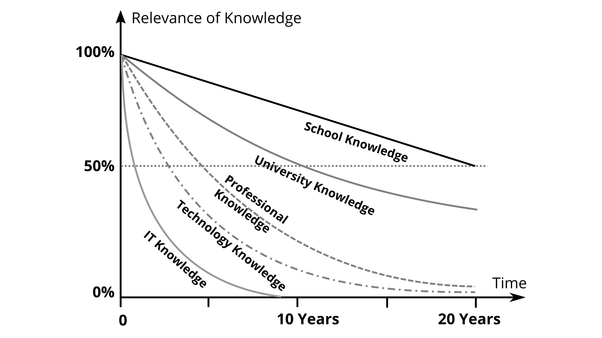

## Lifelong learning and Knowledge Work

We are currently in a very dynamic transition from an industrial to a [knowledge society](https://en.wikipedia.org/wiki/Knowledge_society), which is characterized by rules and norms being continuously challenged through learning processes. As individuals, we can succeed in this society through learning and contribute to the well-being of all.

### Lifelong learning

Learning is the intentional or incidental acquisition of knowledge or skills. This learning process leads to relatively stable changes in behavior, thinking, or feeling as a result of experience or new knowledge.

With the [Delors Report](https://en.wikipedia.org/wiki/Delors_Report), a vision of lifelong learning ("learning throughout life") was published by the European Commission in 1996. The report identifies the four pillars of lifelong learning that should be integrated into education and training:

* **Learning to know** - a broad general knowledge with the possibility to deepen a small number of topics.
* **Learning to do** - to acquire not only professional skills, but also the competence to deal with many situations and to work in teams.
* **Learning to be** - to develop one's own personality and be able to act with growing autonomy, judgment and personal responsibility.
* **Learning to live together** - by developing an understanding of other people and an appreciation of interdependence.

But there are also very practical reasons that make lifelong learning necessary for you. As you can see from the half-life of knowledge graph, some types of knowledge quickly become outdated and require constant learning. While areas such as school knowledge remain reasonably stable, the need for new learning is particularly great in the technology and IT areas.

For the citizens of a society, this means that they should continue to learn even after they have completed their education through school and university, in order not to lose touch. This learning process from birth to death is called lifelong or [lifelong learning](https://en.wikipedia.org/wiki/Lifelong_learning). Until the first education, parents and the state take care of learning in most cases, after that you have to practice [self-organization](https://en.wikipedia.org/wiki/Self-organization).

### Knowledge Work

In his book Landmarks of Tomorrow, Peter Drucker points to a change in the world of work toward knowledge-intensive work tasks, or [knowledge work](https://en.wikipedia.org/wiki/Knowledge_worker), as early as the late 1950s. The knowledge worker is characterized by the fact that he knows better about the work task and the necessary knowledge than the managers of the organization and therefore has to organize himself to a large extent. In contrast to [Scientific Management](https://en.wikipedia.org/wiki/Scientific_management), where there is a separation between headwork and manual work, both come together in the knowledge worker.

The organizational sociologist Hellmut Willke defines knowledge work as activities (communications, transactions, interactions) that are characterized by the fact that the required knowledge is not acquired once in a lifetime through experience, initiation, teaching, specialized training or professionalization and then applied. Rather, knowledge work in the sense meant here requires that the relevant knowledge be

1. continuously revised
2. permanently regarded as capable of improvement
3. is principally not regarded as truth but as a resource, and
4. is inseparably coupled with non-knowledge, so that specific risks are associated with knowledge work.

The german study [Activities and Occupational Requirements in Knowledge-Intensive Occupations](https://lit.bibb.de/vufind/Record/DS-131131) identified the following activities as particularly knowledge-intensive:

* Researching
* Developing
* Researching
* Documenting
* training
* Teaching
* Organizing other people' work processes (yes, managers and executives are also knowledge workers :-)

If your daily work consists to a large extent of one or more of these activities, you can count yourself among the knowledge workers and you belong to the core target group of this guide.

### Productivity of Knowledge Work

[Productivity](https://en.wikipedia.org/wiki/Productivity) is classically defined as the ratio of products produced to the factors of production required to produce them. Peter Drucker, in the book Management Challenges for the 21st Century, summarizes knowledge worker productivity in six factors:

1. knowledge worker productivity damands that we ask the question: **What is the task?**
2. It demands that we impose the **responsibility for their productivity** on the individual knowledge workers themselfs. Knowledge workers have to manage themselves. They have to have autonomy.
3. **Continuous innovation** has to be part of the work, the task, and the responsibility of knowledge workers.
4. Knowledge work requires **continuous learning** on the part of the knowledge worker, but equally **continuous teaching**.
5. **Productivity of the knowledge worker** is primarily not a matter of quantity of results. Quality is at least as important.
6. Finally, knowledge worker productivity requires that **the knowledge worker is both seen and treated as an "asset"** rather than "costs." It requires that knowledge workers want to work for the organization in preference to all other opportunities.

The importance of autonomy, continuous learning (mastery), and independently figuring out the relevant work tasks (purpose) for work in the 21st century is also pointed out by Dan Pink in the well-received TED talk [On the Surprising Science of Motivation](https://www.youtube.com/watch?v=rrkrvAUbU9Y).