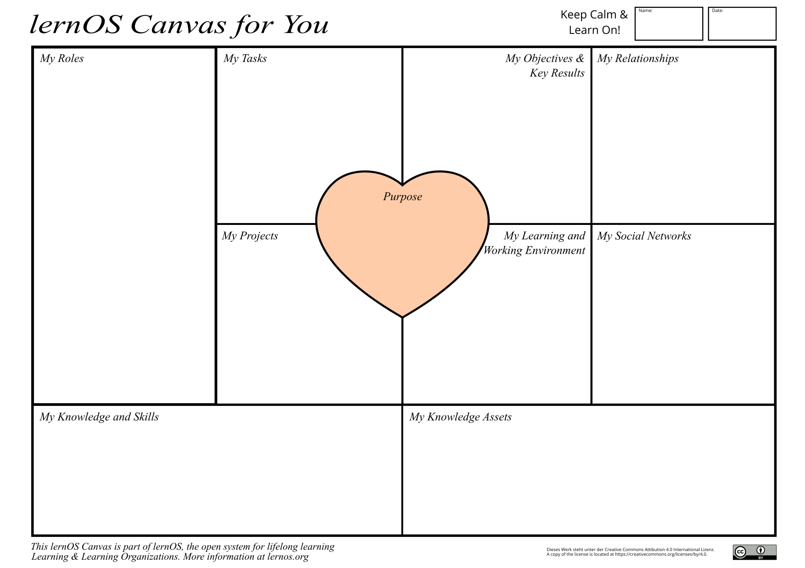

## lernOS Canvas - Overview of Knowledge and Learning Needs

A canvas is a visual structure that can be used to work on multiple areas in parallel. The idea for the lernOS Canvas originally came from Alex Osterwalder, who developed the [Business Model Canvas](https://en.wikipedia.org/wiki/Business_Model_Canvas) for business model development.

The [lernOS Canvas](./images/lernOS-Canvas-for-you-Canvas-en.png) uses the same basic structure, but the naming of the areas has been adapted to cover the relevant topics of the lernOS workflow on an individual level. Before getting into lernOS, you should have completed the Canvas once to get an overview of your current state.

**ProTip:** To be able to work flexibly with the Canvas, you should never write directly on it. That's what sticky notes were invented for! 

In the upper part of the Canvas you can write your name and the date of creation or last modification. If you want to work with the Canvas electronically, you can copy it to OneNote or a digital whiteboard, for example. To fill out the Canvas for the first time, you can ask yourself the following questions, for example:

* **Purpose:** What are you living for? What do you want to accomplish in your life?
* **Objectives & Key Results:** What are your goals for the next 12 weeks? What are the measurable outcomes of those goals?
* **My Roles:** What are your current roles? What are the resulting goals?
* **My Tasks:** What are your current tasks? What are the goals that result from them?
* **My Projects:** What are your current projects? What are the goals that result from them?
* **My Social Networks:** What internal and external social networks (digital and analog) help you network?
* **My Learning and Working Environment:** What does your learning and working environment look like (infrastructure, content, tools, methods, etc.)?
* **My Knowledge and Skills:** What knowledge and skills are important to your goals, roles, tasks, and projects? What do you still need to learn?
* **My Knowledge Assets:** What knowledge assets (documents, checklists, videos, etc.) do you have? Which of these can you offer to your network?