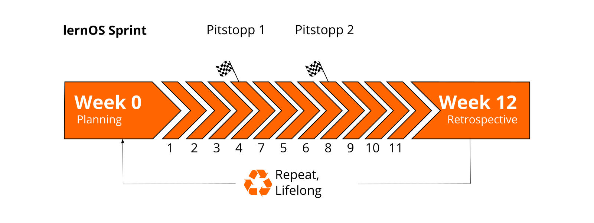
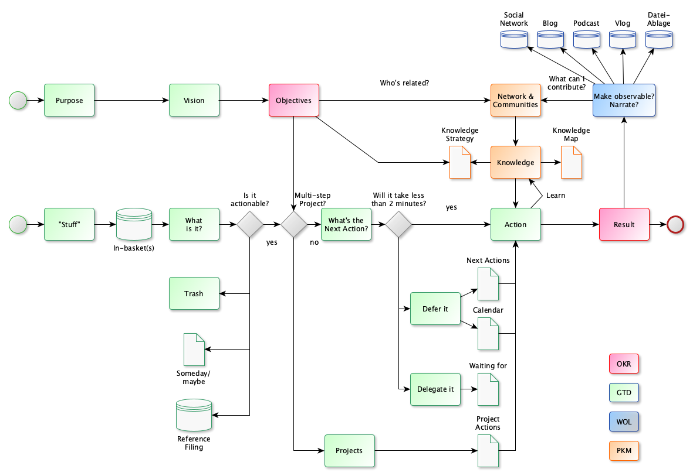

## lernOS Flow - Workflow for Modern Working and Learning

[Flow](https://en.wikipedia.org/wiki/Flow_(psychology)) refers to the feeling of a mental state experienced as blissful, in which you are concentrated and completely absorbed in an activity. In flow, there is a good balance between the demands of the activity and one's own abilities, so that there is neither overload nor underload. In order to enable concentration and focus in our fast and complex world of life and work, a good self-organization system is needed.

The lernOS Flow therefore relies on 13-week cycles, which are called **lernOS Sprints** in reference to [Scrum](https://scrumguides.org). Each sprint begins with planning and goal setting (week 0) and ends with a retrospective (week 12). The four quarters of a year are a good rhythm, but you can adjust this to your preference.

The lernOS Flow is a workflow that knowledge workers and lifelong learners can use for their self-organization. For this purpose, practice-proven methods and approaches are used: 

1. **Objectives & Key Results (OKR)** for goal-oriented and focused work and learning by defining learning objectives and desired outcomes (see also [OKR](https://rework.withgoogle.com/guides/set-goals-with-okrs/steps/introduction/) at Google). *Hint: not included in this version of the guide.*
2. **Getting Things Done (GTD)** for productive and stress-free working and learning by structuring self-organization through a 5-step process (see also [GTD](https://gettingthingsdone.com) by David Allen).
3. **Working Out Loud (WOL)** for openly sharing work results across the network and telling backstories (see also [WOL Definition](https://thebryceswrite.com/2010/11/29/when-will-we-work-out-loud-soon/) by Bryce Williams, [WOL Circle Guides](https://workingoutloud.com/de/fur-dich) by John Stepper). *Hint: not included in this version of the guide.*

In the diagram of the lernOS flow you can recognize the elements from the individual methods by the color marking (OKR: red, GTD: green, WOL: blue): 

The image is best read from left to right.  There are two possible start points (green circles) and one end point (red circle). With the lower starting point, one is more concerned with the short-term and operational handling of knowledge and learning. The upper starting point maps the long-term and strategic perspective (see also [GTD - The 6 Horizons of Focus](https://gettingthingsdone.com/2011/01/the-6-horizons-of-focus/)).

**ProTip:** if you work privately or professionally with Microsoft 365, you will find the Microsoft 365 edition of the lernOS flow in the appendix.

