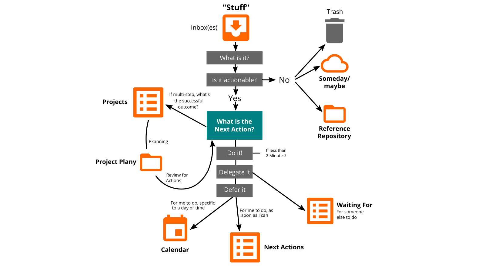

## Learning Path Productivity & Stress-Free

In this learning path you will learn to organize complex knowledge work yourself and to face the daily flood of information without stress. Many people face the problem of sinking into the hamster wheel of daily and routine activities and having no time for important tasks. 

The Productivity & Stress-Free Learning Path is based on David Allen's [Getting Things Done](https://gettingthingsdone.com) (GTD) method. By learning the rules and principles step by step, and practicing them in the katas, you will build your own GTD system in this lernOS Sprint.

Getting Things Done is, at its core, about getting all the tasks and ideas out of your head and into a system you trust (David Allen: "Mind like Water"). You collect the "stuff" that comes rushing at you every day in one or more inboxes. These are regularly processed in a five-step process. To keep the system up to date, weekly (Weekly Review) and daily reviews (Daily Review) are carried out.

You can use the katas in this learning path to learn how to learn and work productively and stress-free in a sprint:

1. **Kata:** Top 10 resources on GTD.
2. **Kata:** Gathering stuff and sweeping the mind
3. **Kata:** Set up your GTD environment
4. **Kata:** Which inbox(es) do you want to use?
5. **Kata:** What lists do you want to create and keep?
6. **Kata:** Inbox Zero in 4 steps
7. **Kata:** Set up your project environment
8. **Kata:** Create your reference file
9. **Kata:** Do a Weekly Review
10. **Kata:** Do a Daily Review
11. **Kata:** The 6 Focus Horizons of Getting Things Done

