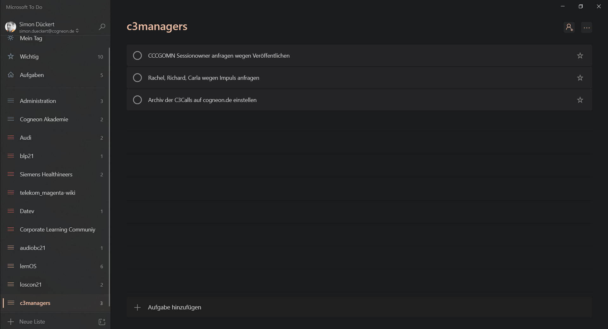

### What Lists Do You Want To Create And Maintain? (Kata)

In this kata, you'll delve a little deeper into each of GTD's list types and decide which of them you want to use.

**Step 1:**

In the Getting Things Done Workbook, David Allen describes the following list types that he recommends for getting started with Getting Things Done. Look through the list and consider which lists you want to create and keep:

* **Next Action List** - a "Next Action" is the next physical and visible step that moves something toward completion.
* **Someday/Maybe List** - list of things and issues you may want to address at a later date.
**Waiting for list** - a list to keep track of things that need to be done by others
* **Project List** - a list of all ongoing projects that need more than one step for completion
**Project Next Action Lists** - a list per project that contains the next steps for that project.

If you need more lists, just add to the list.

**Step 2:**

For each list you need to keep, think about where and how you want to create it and document your approach (e.g. in the lernOS Memex). Now create all lists.

**Example:** The following screenshot shows the management of GTD lists in Microsoft To Do: 

**Additional Information:**

* Video [Next action list](https://gettingthingsdone.com/insights/next-action-list) with David Allen
* [GTD Setup Guide for Microsoft To Do](https://gettingthingsdone.com/wp-content/uploads/2020/12/GTD_Microsoft_To_Do_A4_sample.pdf) by David Allen