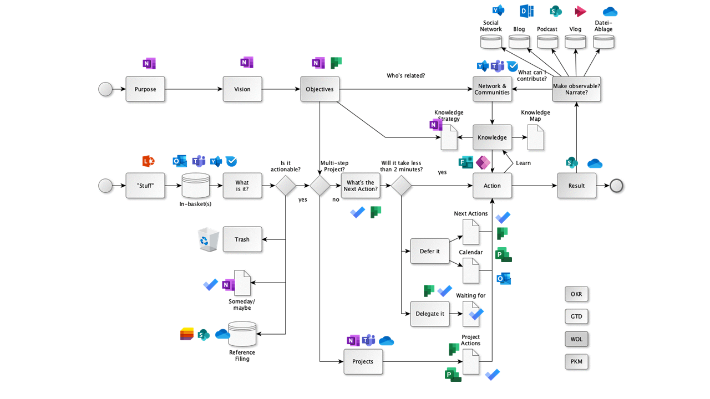

# Appendix

## Circle Facilitation Checklist

When learning in the Circle, the Circle facilitation checklist helps facilitators organize the Circle in a structured way. You can decide in week 0 if one person will coordinate the whole sprint or if you want to rotate the role. It is best to copy the checklist to a place where all Circle members have access to it (e.g. OneNote, Etherpad, OneDrive, Dropbox).

**Week 0 - Sprint Planning & Get Together**

If you don't know each other in the Circle yet, get to know each other in Week 0.
Plan when you will meet, what tools you will use and
and who the moderator will be.

* **Check-in:** Welcome! *(5 minutes)*
* **Get together:** Who are you? Introduce yourself. Five-minute timebox
  per Circle member. *(25 minutes)*
* **Sprint planning** see below *(25 minutes)*.
* **Check-out:** Confirm next meeting. *(5 minutes)*

Define a Circle facilitator to handle event and time management. One of the biggest obstacles to successful Circle is discipline and time management. The facilitator is not the "boss" of the Circle, but a regular Circle member who makes sure things run smoothly. Determine what learning path you will use. Define the day and time of the weekly meeting. Define whether you will meet in person or virtually. Define the tools you will use for communication and documentation in the Circle. Decide which of the suggested exercises you will do in the Circle. Also decide if you want to use the lernOS Canvas (see chapter lernOS Canvas) as a supporting tool.

* **Circle Moderator:** Fixed / Rotating.
* **Day and time of Weekly:** ...
* **Weekly meetings are:** In person / Virtual.
* **Flipped Classroom Approach:** Yes / No.
* **Tools used (can everyone use them?):** ...
* **Do we use Canvas:** Yes / No.

**ProTip:** everyone should do the "Past Forward" and "Thinking Visually with the lernOS Canvas" katas in week 0 to find the right goals for the lernOS Sprint.

**ProTip:** in many cases the time to do the exercises in the Weekly is too short. Therefore use the method [Flipped
Classroom](https://en.wikipedia.org/wiki/Flipped_classroom): each Circle member prepares the exercises as "homework", so you have more time in the Weekly to discuss the results.

**ProTip:** if you want to document your Circle in OneNote or use Microsoft Teams for the Circle, have a look at the [lernOS Circle Template](https://github.com/cogneon/lernos-core/tree/master/lernOS%20Circle%20Template) (available only in German). In it you will find a template for documentation in the Circle.

**ProTip:** If you use the lernOS OneNote Circle Template, you can take a recent photo of your Canvas and
paste it so the other Circle members can see it and give feedback.

**WEEK 1**

* **Check-in:** What have I done since the last check-in? What has happened in terms of key results? What's holding me up? Two-minute timebox per Circle member. *(10 minutes)*
* Talking through the results of the katas in each learning path.
* **Check-out:** What will I do between now and the next Weekly? One-minute timebox per Circle member. *(5 minutes)*

**WEEK 2**

* **Check-in:** What have I done since the last check-in? What has happened in terms of key results? What's holding me up? Two-minute timebox per Circle member. *(10 minutes)*
* Talking through the results of the katas in each learning path.
* **Check-out:** What will I do between now and the next Weekly? One-minute timebox per Circle member. *(5 minutes)*

**WEEK 3**

* **Check-in:** What have I done since the last check-in? What has happened in terms of key results? What's holding me up? Two-minute timebox per Circle member. *(10 minutes)*
* Talking through the results of the katas in each learning path.
* **Check-out:** What will I do between now and the next Weekly? One-minute timebox per Circle member. *(5 minutes)*

**Week 4 & Pit Stop 1**

* **Check-in:** What have I done since the last check-in? What has happened in terms of key results? What's holding me back? Two-minute timebox per Circle member. *(10 minutes)*
* Talking through the results of the katas in each learning path.
* **Check-out:** What will I do between now and the next Weekly? One-minute timebox per Circle member. *(5 minutes)*

**WEEK 5**

* **Check-in:** What have I done since the last check-in? What has happened in terms of key results? What's holding me up? Two-minute timebox per Circle member. *(10 minutes)*
* Talking through the results of the katas in each learning path.
* **Check-out:** What will I do between now and the next Weekly? One-minute timebox per Circle member. *(5 minutes)*

**WEEK 6**

* **Check-in:** What have I done since the last check-in? What has happened in terms of key results? What's holding me up? Two-minute timebox per Circle member. *(10 minutes)*
* Talking through the results of the katas in each learning path.
* **Check-out:** What will I do between now and the next Weekly? One-minute timebox per Circle member. *(5 minutes)*

**WEEK 7**

* **Check-in:** What have I done since the last check-in? What has happened in terms of key results? What's holding me up? Two-minute timebox per Circle member. *(10 minutes)*
* Talking through the results of the katas in each learning path.
* **Check-out:** What will I do between now and the next Weekly? One-minute timebox per Circle member. *(5 minutes)*

**WEEK 8 & Pit Stop 2**

* **Check-in:** What have I done since the last check-in? What has happened in terms of key results? What's holding me back? Two-minute timebox per Circle member. *(10 minutes)*
* Talking through the results of the katas in each learning path.
* **Check-out:** What will I do between now and the next Weekly? One-minute timebox per Circle member. *(5 minutes)*

**WEEK 9**

* **Check-in:** What have I done since the last check-in? What has happened in terms of key results? What's holding me up? Two-minute timebox per Circle member. *(10 minutes)*
* Talking through the results of the katas in each learning path.
* **Check-out:** What will I do between now and the next Weekly? One-minute timebox per Circle member. *(5 minutes)*

**WEEK 10**

* **Check-in:** What have I done since the last check-in? What has happened in terms of key results? What's holding me up? Two-minute timebox per Circle member. *(10 minutes)*
* Talking through the results of the katas in each learning path.
* **Check-out:** What will I do between now and the next Weekly? One-minute timebox per Circle member. *(5 minutes)*

**WEEK 11**

* **Check-in:** What have I done since the last check-in? What has happened in terms of key results? What's holding me back? Two-minute timebox per Circle member. *(10 minutes)*
* Talking through the results of the katas in each learning path.
* **Check-out:** What will I do between now and the next Weekly? One-minute timebox per Circle member. *(5 minutes)*

**Week 12: Retrospective & Celebration**

This week should be the final iteration of your Key Results. Talk about it and show you in the check-in. You will reflect on the Circle experience and talk about how to sustain the process. After the Weekly, take some time to celebrate your success!

* **Check-in:** What have I done since the last check-in? Show the final iteration of the Key Results. Three-minute timebox
  Per Circle member. *(15 minutes)*
* **Your Learning Moments:** Talk about the moments in the Sprint that were special to you. What are your "key learnings?" Consider posting these as a [lernOS Story](https://docs.google.com/forms/d/e/1FAIpQLSc9KrufUD9Mu9wstGv8ojfChRwPlq2dVi_kAUB04MuymmzUSg/viewform) for all other practitioners. _(20 minutes)_
* **After Action Review:** What was the plan for the sprint? What happened? Was there any deviation? What can be learned from it? _(20 minutes)_
* **Check-out:** Are there next steps? Will you stay together for another sprint?
* **Party Time!** *(You choose the duration)_ *

## lernOS Flow - Microsoft 365 Edition

The Office 365 Edition of the lernOS Flow (see Fundamentals) includes suggestions for which tools from the [Microsoft 365](https://en.wikipedia.org/wiki/Microsoft_365) ecosystem can be used for each element of the Flow.

## Acknowledgements

lernOS is inspired by many people and sources and therefore stands [on the shoulders of giants](https://en.wikipedia.org/wiki/Standing_on_the_shoulders_of_giants). I have compiled an overview of the roots and inspirations [in the lernOS Wiki](https://github.com/cogneon/lernos-core/wiki). For this guide, I would like to give special thanks to:

- **Hirotaka Takeuchi** and **Ikujiro Nonaka** for introducing the term Scrum to agile innovation methods (1986).
- **Jeff Sutherland** and **Ken Schwaber** for defining agile project management in the [Scrum Guide](https://scrumguides.org) (2010).
- **David Allen** for the [Getting Things Done](https:/gettingthingsdone.com) (GTD) method, which shows the way to stress-free productivity for knowledge workers*.
- **Andy Grove** for developing the [Objectives & Key Results](https://de.wikipedia.org/wiki/Objectives_and_Key_Results) (OKR) method as an evolution of Peter Drucker's Management by Objectives (MbO) at Intel (1980s). **John Doer** for introducing OKR at Google and **Rick Klau** of Google Ventures for his talk [How Google sets goals: OKRs](https://www.youtube.com/watch?v=mJB83EZtAjc) (2013).
- **Glyn Moody** (2006) and **Bryce Williams** (2010) for the concept and definition of Working Out Loud as "Observable Work + Narrating Your Work". **John Stepper** for designing the 12-week WOL learning program documented in the [WOL Circle Guides](https:/workingoutloud.com/circle-guides) (2015). **Katharina Krentz** of Bosch for her many contributions to making Working Out Loud useful in organizations.
- **Johannes Müller** and **Tobias Müller-Zielke** for the presentations on OKRs and GTD at the lernOS Rockstars Camp 2019 and **Alexander Rose** for putting together the GTD Learning Path.

## Change history.

All changes to the guide can be found in the [Release Notes on Github](https://github.com/cogneon/lernos-for-you/releases). The sources of all previous guide versions are also available there.